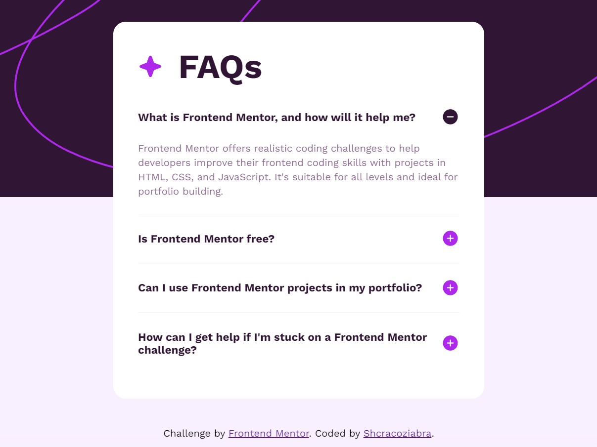

# Frontend Mentor - FAQ accordion solution

This is a solution to the [FAQ accordion challenge on Frontend Mentor](https://www.frontendmentor.io/challenges/faq-accordion-wyfFdeBwBz). Frontend Mentor challenges help you improve your coding skills by building realistic projects. 

## Table of contents

- [Overview](#overview)
  - [The challenge](#the-challenge)
  - [Screenshot](#screenshot)
  - [Links](#links)
- [My process](#my-process)
  - [Built with](#built-with)
  - [What I learned](#what-i-learned)
  - [Continued development](#continued-development)
  - [Useful resources](#useful-resources)
- [Author](#author)

## Overview

### The challenge

Users should be able to:

- Hide/Show the answer to a question when the question is clicked
- Navigate the questions and hide/show answers using keyboard navigation alone
- View the optimal layout for the interface depending on their device's screen size
- See hover and focus states for all interactive elements on the page

### Screenshot



### Links

- Solution URL: [GitHub](https://github.com/Shcracoziabra/faq-accordion)
- Live Site URL: [Netlify](https://shcraco-faq-accordion.netlify.app)

## My process

In this challenge I practised to create responsive and accessible web page.
- [x] Implemented hiding/showing the answer to a question when the question is clicked
- [x] Added page navigation and hiding/showing the answer to a question with Tab and Enter keys
- [x] Used CSS media-query to achieve responsible page elements size
- [x] Interactive elements on the page react on hover and focus states
- [x] Improved hiding-showing behavior with smooth transition

### Built with

- Semantic HTML5 markup
- CSS Flexbox
- CSS media queries 
- JS (DOM API)

### What I learned

- Learned to make interactive page for keyboard navigation with `:focus` pseudoelement and `HTMLElement.blur()` method
- Made an animated accordion using JS and transitions on elements with `[area-expanded]` attribute.

```css
.accordion-item[area-expanded=true] h2 {
    background-image: url("./assets/images/icon-minus.svg")
}

.accordion-item[area-expanded=true] p {
    opacity: 1;
    min-height: -moz-fit-content;
    min-height: fit-content;
    padding-bottom: 25px;
    transition: all .3s linear
}

.accordion-item[area-expanded=false] h2 {
    background-image: url("./assets/images/icon-plus.svg")
}

.accordion-item[area-expanded=false] p {
    opacity: 0;
    max-height: 0;
    padding: 0;
    overflow: hidden;
    transition: all .3s linear
}
```

### Continued development

 I'd like to follow web accessibility practices.

### Useful resources

- [W3C](https://www.w3.org/WAI/ARIA/apg/patterns/accordion/examples/accordion/) - This helped me to make an accessible accordion.
- [MDN web docs](https://developer.mozilla.org/en-US/docs/Web/API/Element/keydown_event) - MDN article about keydown event.
- [MDN web docs](https://developer.mozilla.org/en-US/docs/Web/API/HTMLElement/blur) - Adding and removing focus from an element.
- [MDN web docs](https://developer.mozilla.org/en-US/docs/Web/CSS/CSS_backgrounds_and_borders/Using_multiple_backgrounds) - Using background images.

## Author

- GitHub - [Tetiana B.](https://github.com/Shcracoziabra)
- Frontend Mentor - [@Shcracoziabra](https://www.frontendmentor.io/profile/Shcracoziabra)